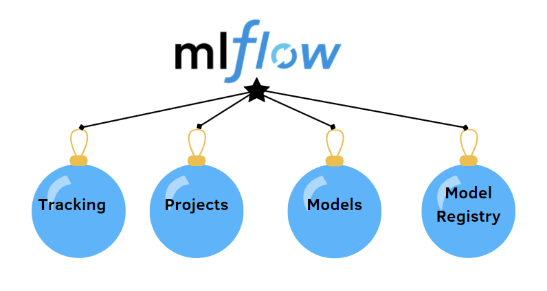

# MLflow_Python



## What is MLflow ?
MLflow is a product of Databricks an open source platform for managing the end-to-end machine learning lifecycle.
MLflow has the following components which you can use to leverage your ML projects:- 
1. Tracking: Allows you to track experiments to record and compare parameters and results.

2. Models: Allow you to manage and deploy models from a variety of ML libraries to a variety of model serving and inference platforms.

3. Projects: Allow you to package ML code in a reusable, reproducible form to share with other data scientists or transfer to production.

4. Model Registry: Allows you to centralize a model store for managing models’ full lifecycle stage transitions: from staging to production, with capabilities for versioning and annotating.

5. Model Serving: Allows you to host MLflow Models as REST endpoints

### This Repository contains:-
##### Part 1:- Tracking a Linear regression model's performance by tuning different hyperparameters:-
1. A simple Elasticnet regression model with hyper parameter tuning.
2. Logging subsequent metrics & parameters of the testing into mlflow dashboard.
3. Comparing the model perfomance from MLflow dashboard using the logged metrics of various experiments.
4. MLflow on localhost with a Tracking server & SQlite database.
4. Optionally using MLflow with a remote Tracking server, backend & artifacts stores.

#### Part 2:- Tracking a TensorFlow model's performance:-
* This will contains same steps as for the ML model on Part 1.


## Setting up virtual environment:-
1. Conda virtual envronments:-
* Creating virtual environment using conda:-
```
conda create --prefix ./env_name
```

* Activating the virtual environment:-
```
conda activate ./env_name
```
2. Python virtual environments:-
 * Creating virtual environment in python:-
```
virtualenv -p /usr/bin/python3 virtualenv_name
```
* Activating Python virtual environment:-
```
source virtualenv_name/bin/activate
```

### Installing required libraries:-
* After activating the virtual environment, install the necessary libraries using:-
```
pip install -r requirements.txt
```

# Part1:- MLflow for Sklearn
A simple MLfow code to track & test your machine learning algorithms performance.

### Running the main code:-

Default:-
```
python mlflow_lr.py
```

To give custom values for alpha & l1_ratio:-
```
python mlflow_lr.py alpha_value l1_ratio_value
```

### Result after running the code:-
Upon running the main code subsequent results will be stored in newly created **mlruns** folder inside the same working directory
```
mlruns/
```

### Visualizing the performance on dashboard:-
After testing different hyperparameters values you can visualize/compare the performance metrics using dashboard which mlflow will create using the results stored in **mlruns/** folder.
* Run following command to view & comapre the results on dashboard on localhost.
```
mlflow ui
``` 

Create a short video of navigation on ui:-
1. select all the checkboxes
2. select compare
3. select Parallel Coordinates Plot for better visualization

## Setting a Tracking server url & SQlite database
### Setting tracking server url:-
```
mlflow.set_tracking_uri("http://127.0.0.1:1234")
```

### Creating a seperate experiment name:-

If you just run the code without setting any experiment name it will log all the values to the default tab in mlflow dashboard.

Set a custom experiment name:-
```
mlflow.set_experiment('MLflow demo')
```

After giving certain experiment name all the result of that paricular experiment will be logged to the given experiment name in the MLflow UI

### Hosting MLflow on the newly added tracking server url:-
After setting the tracking server url and experiment name in mlflow_lr.py, before running the mlflow_lr.py, we need to run the server locally.

1. MLflow server command
```
mlflow server \
--backend-store-uri sqlite:///mlflow.db \
--default-artifact-root ./artifacts \
--host 127.0.0.1 -p 1234
```
* Arguments:-
```
--backend-store-uri : A sqlite database to store all the data - sqlite://name_of_database.db
--default-artifact-root : folder where only artifacts will be stored, rather than mlruns storing everything. 
--host : Host url
-p : Port Number
```
2. MLflow driver code:-
After that we have to run mlflow_lr.py to create new experiments
```
python mlflow_lr.py
```
OR
```
python mlflow_lr.py alpha_value l1_ratio_value
```
# NOTE:-
1. If you set the tracking server url then you have to run the tracking server locally first followed by the mlflow_lr.py, otherwise it will throw an error.
* Then you can access the dashboard using the mlfow server link.
2. If you have not set the remote tracking url then you can directly run the mlflow_lr.py
* After this since it is a normal run where you are not using a server you can use ```mlfow ui``` to access the dashboard

3. Any additional changes like **run_name** if added will also be reflected on the UI.
4. MLflow also tells you execution time.

## Navigating to the Models tab after comapring the results
Models tab on the dashborad shows the registered models i.e. the models for which we have run the experiments. For ex:- If we run the mlflow_lr.py 4 times with different hyperparameters values under the exp name:-"ElasticWineModel", the experiment will show 4 different versions with the latest version as the 4th one.

Further you can view any of these 4 versions and tag them accordingly, i.e select stage for the version. 

For ex:- If version is the one that you feel is the correct one, you can stage it as "Production" under the stage dropdown

Different stage states:- 
1. Staging - Pre production stage where testing happens
2. Production - Final stable/accurate version for production
3. Archive - not to be used in production 

### So as a recap on setting tracking server on localhost:- 
1. Set the tracking url     
2. Set the experiment name to log all the results of that experiment within it.
3. Register the model name - to log results of that model to that model name with certain version for tracking experiment results.

## Important points:-
* Dynamic model name registering- Additionally you can also use the time module of python in conjunction to the registered model name to log results of that specific model with a timestamp  which will register each model with a unique timestamp.

* But that wont be necessary everytime as MLflow deals with that by creating versions of every run, so for a model with name ElasticWineModel2, if you run the experiment for this model 2 times(hyperparameter tuning) then for each version it will keep a version number with time of creation for tracking.

### Navigating metrics graph within the models tab:-
You can also compare the results of the performance metrics by using bar graph by comparing all the versions.

### Publishing experiment results:-

You can download the results from the mlflow ui as a csv file for future reference.

### Things to be covered:-
1. Hosting the MLflow server on remote host.

# Tensorflow/Keras:- 
Run:-
```
python tf_mlflow_demo.py
```

## Logging the results:-

mlflow.tensorflow.autolog() is used to log the results. This function autolog the results so it logs all the unnecessary info with the needed one also. 

### Drawback:-
With autolog we'll not be able to use the database functionality like in prvious one(sqlite)

### Results of experiments:-

Results of the tf experiment will bestored similarly to the mlruns folder as same as the sklearn results.

### Visualizing the pperformance on dashboard:-
After testing different hyperparameters values you can visualize the performance using dashboard similar to sklearn above which mlflow will create using the results stored in mlruns folder.
* Run following command to view & comapre the results on dashboard.
```
mlflow ui
```

### Results stored in mlruns folder for Tensorflow/Keras:-

It basically stores almost all the neccessary results, like:-
1. Model summary
2. Metrics like:- accuracy, loss, val_accuracy, val_loss
3. All neccessary hyperparameters in params/ folder


# In mlflow_lr.py :-

You can also log any value to param or metriic that you thibk is necessary for tracking model performance

For ex:- mlfow.log_param("name", "karthik")
         mlflow.log_param("seed",42)
         mlflow.log_metric("some_metric", value)

Absolutely anything and then that respective para/ metric that you have added will get stored in mlruns and you can navigate in the dashboard to playaround and compare the performance

## Author :-
[Karthik Arumugam](https://github.com/KarthikArumugam3)